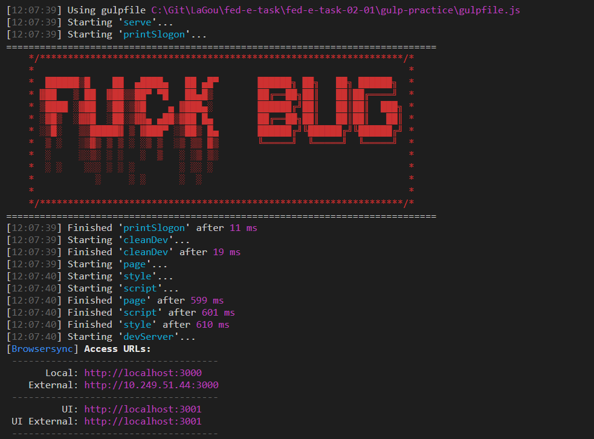
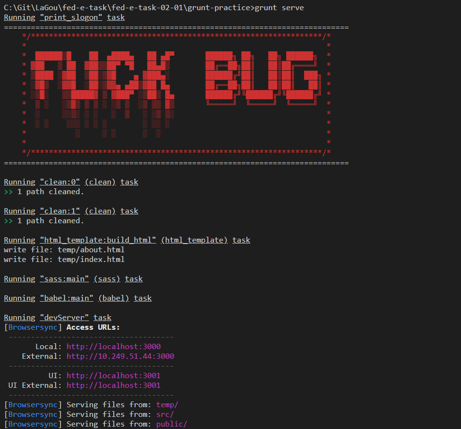
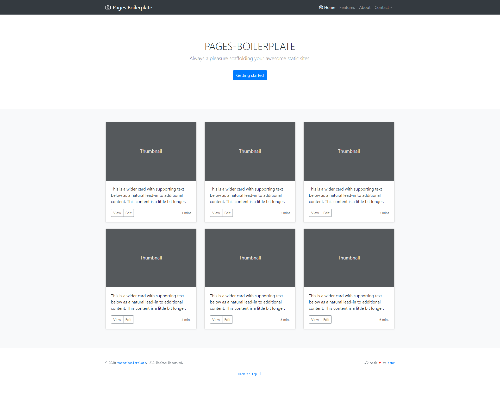

# 陈刚 | Part 2 | 模块一 脚手架&自动化构建
## 简答题

### 1、谈谈你对工程化的初步认识，结合你之前遇到过的问题说出三个以上工程化能够解决问题或者带来的价值。

1.   问题一，代码不规范，
  开发人员代码不规范，导致业务代码混乱，无lint 检查，无可用格式化插件，手动部署文件无压缩，前端加载太大，
2. 问题二，代码文件混合复杂（1000+ lines）增加运维成本
   没有考虑组件化和模块化开发解耦，让单一职责文件负责一个功能或业务属性，代码结构清晰定义等
###  前端工程化是使用软件工程的技术和方法来进行前端项目的开发、维护和管理
1. 代码规范: 保证团队所有成员以同样的规范开发代码。
2. 分支管理: 不同的开发人员开发不同的功能或组件，按照统一的流程合并到主干。
3. 模块管理: 一方面，团队引用的模块应该是规范的;另一方面，必须保证这些模块可以正确的加入到最终编译好的包文件中。（以上两点可以总结为模块化或者组件化开发。）
4. 自动化测试：为了保证和并进主干的代码达到质量标准，必须有测试，而且测试应该是自动化的，可以回归的。
5. 构建：主干更新以后，自动将代码编译为最终的目标格式，并且准备好各种静态资源，
6. 部署。 将构建好的代码部署到生产环境。

### 2、你认为脚手架除了为我们创建项目结构，还有什么更深的意义？

脚手架是使用command line 来完成一整套标准项目生成的工具，有点类似于汽车某车型的生产线，在项目开发工程中，为了大大提高工作效率，以及工作方式的统一，使用脚手架可以完成统一的配置，避免重复性的造轮子，并且保证每个轮子在出厂时的标准时一样的，在项目开发过程中，根据项目的特征和业务属性定制符合当前项目的脚手架，来完成高质量的项目交付，轮子标准模型越多，适应项目场景也就越加丰富。

## 编程题

### 1 概述脚手架实现的过程，并使用 NodeJS 完成一个自定义的小型脚手架工具

脚手架实现的过程：

1. 通过命令行交互询问用户问题
2. 根据用户回答，在指定的位置生成相应的文件。

完成了一个基于 base 基础项目内容的脚手架

gulp 和 grunt 运行截图：

### Gulp ：

### Grunt ：

效果截图：

### 2 尝试使用 Gulp 完成 项目 的自动化构建

思考开发环境和生产环境的任务

#### 开发环境

整体思路：

1. 主要关注 HTML/SCSS/JS 资源的实时编译与加载
2. 静态资源不做特殊处理
3. 需要起一个本地服务器供我们开发调试代码。
4. 目录清理
5. 输出到指定目录，为了与正式环境目录区分开发，定义临时目录存放开发环境编译的代码。
6. 增加slogon 打印

##### 代码编译

1. HTML 的模板编译(借助`gulp-swig`)
2. Scss 的编译(借助`gulp-sass`)
3. JS 新特性代码编译成浏览器可执行的代码（借助`gulp-babel`）

##### 本地开发与代码热更新

借助 `browser-sync` 提供本地服务器功能;

配合 gulp 提供的 `watch` 监听开发目录下文件的变化，告知服务器重载资源 `bs.reload`

##### 处理引用

使用　`browser-sync` 的路由 `router` 功能将引用依赖项映射到本地资源去获取

##### 目录清理

使用 `del` 模块清理目录

#### 正式环境

整体思路：

1. HTML/SCSS/JS 资源的编译与压缩
2. 静态资源的压缩;
3. 根据引用注释，处理引用的关联以及第三方代码合并;
4. 目录清理
5. 将构建完成的文件输出到指定位置
6. 增加slogon 打印

#### 最终完成功能

##### 开发环境

1. 构建前目录清理
2. html/js/css 源代码编译,输出到临时目录
3. 本地服务器加载临时目录文件，监听 src 文件夹改动，热更新

##### 生产环境

1. 构建前目录清理
2. html/js/css 源代码编译,输出到临时目录
3. 处理文件引用，根据构建注释合并引用文件，html/css/js,静态资源文件压缩

### 3 使用 Grunt 完成 项目 的自动化构建

#### 最终完成功能

##### 开发环境

1. 构建前目录清理
2. html/js/css 源代码编译,输出到临时目录
3. 本地服务器加载临时目录文件

##### 生产环境

1. 构建前目录清理
2. html/js/css 源代码编译,输出到临时目录
3. html/css/js,静态资源文件压缩

