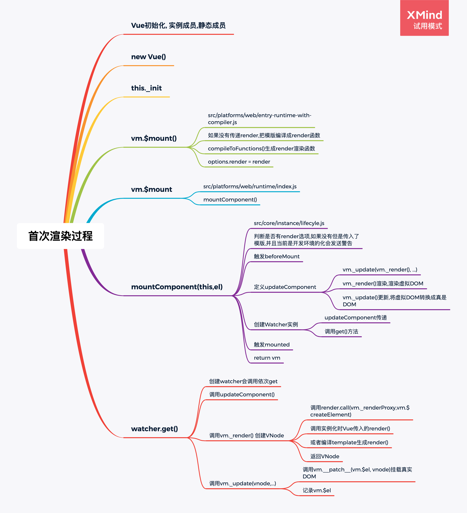
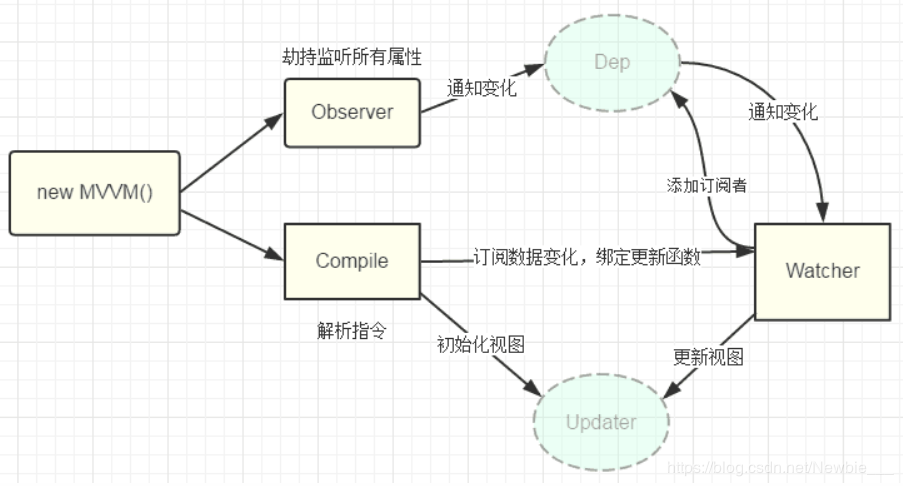
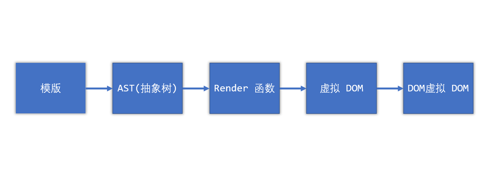

# 陈刚 | Part 3 | 模块二 Vue.js 源码分析（响应式、虚拟 DOM、模板编译和组件化）

## 一、简答题

### 1、请简述 Vue 首次渲染的过程。。

  1. 首先进行 Vue 的初始化，即初始化 Vue 的实例成员和静态成员
  2. 当初始化结束后会调用 Vue 的构造函数，在 Vue 的构造函数内调用\_init()方法
  3. \_init()是所有方法的入口，在\_init()内最终调用了\$mount()
  4. \$mount()函数会先判断是否传入了 render 函数，如果没有传入会获取 template 选项，如果 template 也不存在会把 el 中的内容做完模板 最终编译成 render 函数，然后吧 render 函数存到 options.render 中，如果是运行时版本会重新获取 el
  5. 判断是否有 render 选项且传入了模板，并且是开发环境时会发送一个警告，告诉我们运行时版本不支持编译器
  6. 触发 beforeMount 钩子函数
  7. 定义 updateComponent，通过\_render()生成虚拟 DOM，通过\_update()把虚拟 DOM 转换为真实 DOM 并挂载到页面
  8. 创建 Watcher 对象，调用 get 方法
  9. 触发 mounted 钩子函数，并返回 Vue 实例

### 2、请简述 Vue 响应式原理。

  当一个 Vue 实例创建时，vue 会遍历 data 选项的属性，用 Object.defineProperty 将它们转为 getter/setter 并且在内部追踪相关依赖，在属性被访问和修改时通知变化。 每个组件实例都有相应的 watcher 程序实例，它会在组件渲染的过程中把属性记录为依赖，之后当依赖项的 setter 被调用时，会通知 watcher 重新计算，从而致使它关联的组件得以更新。

### 3、请简述虚拟 DOM 中 Key 的作用和好处。

  在设置 key 以后虚拟 DOM 的更新会使用 Key 作为对比标准进行对比，这样可以避免在不设置 Key 时直接使用 tag 来判断 DOM 是否相同而引起多不必要渲染

### 4、请简述 Vue 中模板编译的过程。

  1. 首先从缓存加载编译好的 render 函数，如果缓存中没有的话调用 compile 函数进行编译
  2. compile 函数先进行 option 选项的合并，然后调用 baseCompile 编译模板
  3. 把模板和合并好的选项传递给 baseCompile 后，baseCompile 首先把模板转化成 AST tree（抽象语法树）；然后对 AST tree 进行优化，标记静态根节点，静态根节点不需要每次被重绘，patch 的过程中会跳过静态根节点；最后把优化后的 AST tree 转换成 js 代码
  4. 进而把字符串形式的 js 代码转换为 js 函数，当 render 和 staticRenderFns 初始化完毕，它们都会被挂载到 Vue 实例的 options 对应属性中
